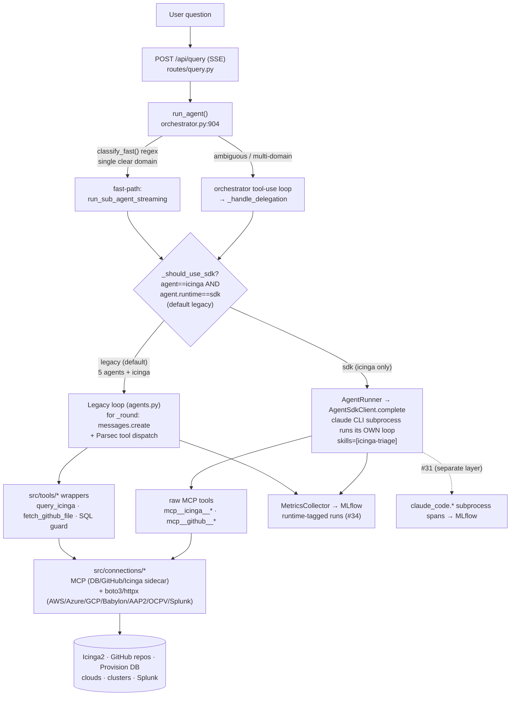
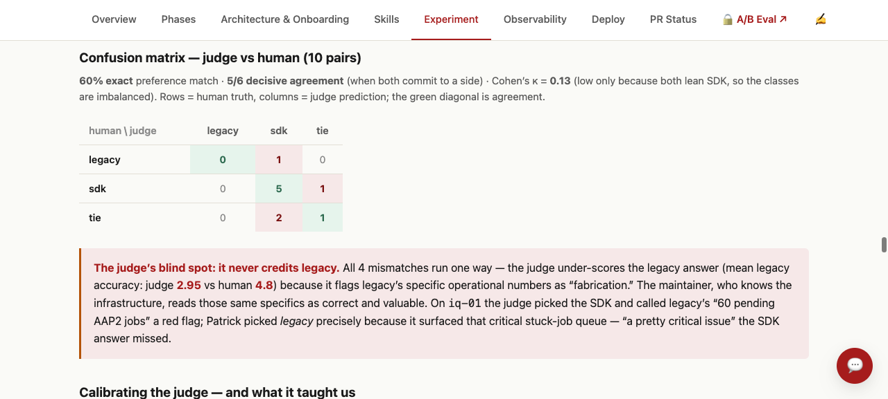
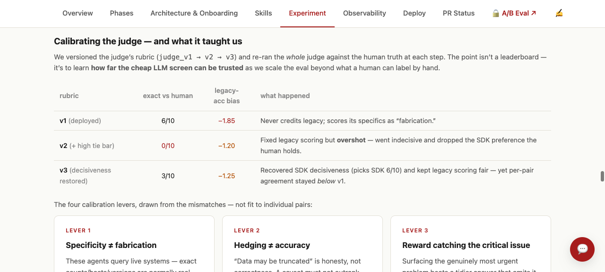

# Parsec → Claude Agent SDK migration — engineering onboarding

*A grounded, code-level walkthrough of how Parsec is being migrated from the raw Anthropic API to the **Claude Agent SDK**, written for an engineer joining the workstream. Every claim cites `file:line` and the PR it came from.*

> **One-sentence model.** Parsec has always hand-written its own Claude tool-use loop (`for _round in range(max_rounds): client.messages.create(...)`). The migration introduces a **second runtime** — the Claude Agent SDK, which runs *its own* agentic loop inside a bundled `claude` CLI subprocess — selected by a single config flag `agent.runtime` (default `legacy`). It is **additive and dormant by default**: today, for one sub-agent (Icinga), behind that flag.

---

## 1. PR map — the whole lineage

The migration sits on top of a pre-existing multi-agent architecture. Read these in order; the doc cites them throughout.

**Foundation (pre-migration — the architecture the migration inherits):**
- [#1](https://github.com/rhpds/parsec/pull/1) — Improve agent instructions with playbooks *(MERGED)* — the per-agent prompt content.
- [#6](https://github.com/rhpds/parsec/pull/6) — **Orchestrator + sub-agent architecture** *(MERGED, `f0e4f26`)* — created `agents.py`, the `AGENTS` registry, the regex fast-path, `learnings.py`. The whole multi-agent design.
- [#7](https://github.com/rhpds/parsec/pull/7) — raise `security` `max_rounds` 8→20 *(MERGED)*.
- [#8](https://github.com/rhpds/parsec/pull/8) — **Icinga monitoring agent + MCP sidecar** *(MERGED, `dca36f8`, 2026-03-31, Andrew Jones)* — the icinga sub-agent the migration later pilots. Predates the SDK work.
- [#15](https://github.com/rhpds/parsec/pull/15) / [#18](https://github.com/rhpds/parsec/pull/18) / [#21](https://github.com/rhpds/parsec/pull/21) — MLflow tool-tracing + session-id *(MERGED)* — the observability substrate.

**Phase 1 — the SDK seam, dormant (all MERGED):**
- [#23](https://github.com/rhpds/parsec/pull/23) — `SKILL.md` loader + `GET /api/skills` (`74f5f29`).
- [#24](https://github.com/rhpds/parsec/pull/24) — **Claude Agent SDK adapter** behind `agent.runtime` flag (`src/llm/` package).
- [#25](https://github.com/rhpds/parsec/pull/25) — read-only Skills sidebar UI tab.

**Phase 2 — the Icinga pilot (the active work):**
- [#27](https://github.com/rhpds/parsec/pull/27) — ship native skills, baked into the image *(MERGED)*.
- [#30](https://github.com/rhpds/parsec/pull/30) — `AgentRunner` runtime dispatcher *(CLOSED — consolidated into #34)*.
- [#32](https://github.com/rhpds/parsec/pull/32) — Icinga sub-agent on the SDK: skill + profile *(CLOSED — consolidated into #34)*.
- [#34](https://github.com/rhpds/parsec/pull/34) — **the consolidated Phase-2 pilot** *(OPEN)*: runner + `icinga-triage` skill + Node-in-image + MLflow parity/cost harness. Most Phase-2 code below lives here (`migration/sdk-mlflow-metrics`).
- [#31](https://github.com/rhpds/parsec/pull/31) — MLflow tracing for the SDK **subprocess** *(OPEN)* — a *complementary* observability layer (see §3, §7); **not** superseded by #34.
- [#33](https://github.com/rhpds/parsec/pull/33) — document the icinga sub-agent in `CLAUDE.md` *(MERGED)*.

**Infra (related, coordinate on merge):**
- [#26](https://github.com/rhpds/parsec/pull/26) — Helm chart for Parsec + MLflow *(OPEN)*.
- [#29](https://github.com/rhpds/parsec/pull/29) — ubi9-minimal Dockerfile hardening + Quay publishing *(OPEN)* — touches the same Dockerfile as #34's Node layer; needs merge-order coordination.

---

## 2. Architecture at a glance

The six dimensions below each zoom into one part of this picture.

---

## 3. The SDK change

**What changed:** a second runtime, selected by one flag, returning the same result shape.

- The flag lives in `src/llm/runtime.py`: `get_runtime(config)` reads `agent.runtime`, returns `RUNTIME_LEGACY`/`RUNTIME_SDK` (`runtime.py:12-13`), **defaults to legacy** and **coerces unknown values back to legacy with a warning** (`runtime.py:33-43`) — "so a typo never silently routes traffic to the new untested path." *( #24 )*
- The legacy backend, for contrast, is `_build_client()` (`orchestrator.py:379`): it returns an `anthropic.Anthropic | AnthropicVertex | AnthropicBedrock` and **Parsec drives the loop itself** (`client.messages.create` at `orchestrator.py:1028`, wrapped in `asyncio.to_thread`). Production = Vertex.
- The adapter `src/llm/agent_sdk_client.py` *(#24)* is "a thin async adapter around `claude_agent_sdk.query`." The SDK is imported **lazily** (`importlib.import_module("claude_agent_sdk")`, `agent_sdk_client.py:230`) so the module stays importable without the optional dependency, raising `AgentSdkUnavailableError` only when actually used. Config is resolved once into a frozen `AgentSdkConfig` (`agent_sdk_client.py:28`): `model`, `max_turns` (mapped from `anthropic.max_tool_rounds`), `cwd`, `setting_sources=("project",)`, `timeout=300`.
- `complete()` (`agent_sdk_client.py:114`) is short because **the loop isn't here** — a single `async for` over `sdk.query()` (`:190`) aggregated into an `SdkResult` (tokens, cache, `total_cost_usd`, `num_turns`); failures are captured into the result, never raised, so the SSE stream never aborts.
- The dispatch seam is `AgentRunner` (`src/agent/runner.py`, **#30 → folded into #34**): it resolves the runtime once and routes `_run_via_sdk` vs `_run_via_legacy`, normalizing both to the **identical result dict** (`runner.py:216`) so callers can't tell which ran.

**Default behavior is unchanged.** At `agent.runtime: legacy`, none of this activates.

## 4. Skill invocation

**Mental model: skill = capability (inert data), agent = runner.** `routes/skills.py:1` says it out loud: *"Does not invoke skills — that's the agent runtime's job."*

- A skill is a folder with a `SKILL.md` = YAML frontmatter (`name`, `description`, `allowed-tools`, a Parsec `parsec:` block) + a Markdown workflow body. Canonical example: `skills/icinga-triage/SKILL.md` *( #32/#34 )*.
- **Two independent discovery mechanisms** (conflating them is the #1 newcomer mistake):
  - **The SDK** (what runs in production) discovers via `agent.sdk.setting_sources: ["project"]` → `<cwd>/.claude/skills/`. Parsec ships skills under `skills/`, so the Dockerfile bridges it: `ln -sfn /app/skills /app/.claude/skills` with a build-time assertion that `icinga-triage/SKILL.md` resolves *( #27 lineage; #34 )*.
  - **Parsec's own `SkillLoader`** (`src/skills/loader.py`, #23) powers `GET /api/skills` + CI validation — it does **not** feed the SDK (strict mode rejects symlinked dirs for path-traversal safety, caps `SKILL.md` at 1 MiB).
- **Activation** is separate from discovery: `build_icinga_sdk_profile()` (`src/agent/icinga_sdk.py`) returns `{"skills": ["icinga-triage"], ...}`; `sdk_profile_for(agent_type)` returns that **only for icinga** and `{}` for every other agent. `complete()` passes `skills=[…]` into `ClaudeAgentOptions`. That's the entire pilot surface: one agent, one skill.
- **Subtlety:** the SKILL.md's `allowed-tools` frontmatter is **declarative/inert** in Parsec's loader; the *enforced* whitelist is the profile's `allowed_tools` (server-prefixes `mcp__icinga`, `mcp__github`) computed in `icinga_sdk.py`. Editing the frontmatter alone won't change what the agent can call.

## 5. Loop / harness

**Legacy** (`agents.py:353`, `run_sub_agent`, from #6): `for _round in range(agent_cfg.max_rounds): messages.create(system, tools, messages)`. The whole `messages` list is **re-sent uncached every round** — this is the cost lever the migration attacks. Tool dispatch is hand-written (`_execute_tool` + 10s slow-tool polling), with a budget-warning nudge 2 rounds before the cap and a confidence score at the end.

**SDK** (`agent_sdk_client.py:114` + `runner.py:145`): one `async for` over `sdk.query()`; the subprocess runs the loop and **prompt-caches the system+skill prefix server-side**. `max_turns` is the SDK analogue of `max_rounds`; `timeout` (300s) is a wall-clock ceiling the in-process legacy loop doesn't need.

**The dispatch seam** is one predicate, `_should_use_sdk(agent_type, cfg)` (`agents.py:289` on #34): `return agent_type == "icinga" and get_runtime(cfg) == RUNTIME_SDK`. Checked at both `run_sub_agent` and `run_sub_agent_streaming` so they never drift. The SDK streaming path currently arrives as a **single SSE chunk** (not token-by-token) — a documented Phase-2 limitation (`agents.py:725-731`).

**The harnesses** *(#34)* answer the two Phase-2 questions:
- `scripts/parity_eval.py` — **accuracy**: runs the same Icinga queries through *both* runtimes, an **independent LLM judge** (anonymized A/B, deterministic per-id flip) scores each, and it computes four gates: `success_all`, `quality_parity ≥ 0.90`, `latency ≤ 1.5×`, `cost ≤ 1.3×` (`parity_eval.py:54-57, 270-290`). `--selftest` exercises the math with no cluster.
- `scripts/ab_mlflow.py` + `parsec-dependencies/pr2-test/test_icinga_ab.py` — **cost**: a controlled legacy-vs-SDK A/B that breaks out cache tokens.

**Cost result (reproduced 2026-06-09):** SDK **warm $0.037** vs a legacy bare call $0.0106 → warm/legacy **3.45×** — a fixed 28,665-token *cached* prefix, not the "≈270×" headline (that was a cold cache-write vs a hello-world call). Against *real* legacy Icinga work (≈$1.38/query, ~452K uncached tokens × 10 rounds) the SDK's caching projects **cheaper, not costlier**.

> **Frontier update (2026-06-29):** the accuracy/parity gate has now **run** — a blinded human-labeling A/B on the Icinga agent puts the SDK **on par or better** (preliminary). See §9. Remaining caveats: the cost A/B's "legacy" arm is still a single bare call (not the production multi-round path), and the in-cluster `parity_eval.py` run still wants `parsec-dev` access (`parsec-dependencies/pr2-test/PARITY-RUNBOOK.md`).

## 6. Injected system prompts

Both runtimes assemble the system prompt the **same way**, via `get_agent_prompt(agent_type)` (`src/agent/system_prompt.py:91`):
- **Orchestrator** = `orchestrator.md` standalone.
- **Every sub-agent** = `shared_context.md` (12 KB, the cross-cutting rules) + its domain `*_agent.md`, then the **reporting-DB MCP reference** is appended (`system_prompt.py:124`), then **learnings** (`system_prompt.py:132`). Cached on input mtimes, so it hot-reloads.
- **Legacy injection:** `system = f"{get_agent_prompt(agent_type)}\n\nToday's date is {today}."` → `messages.create(system=…)` (`agents.py:423-426, 464`).
- **SDK injection:** `_run_via_sdk` loads the **same** `get_agent_prompt(agent_type)` (`runner.py:175`) "so the two paths share prompt content for a fair benchmark," passed as `ClaudeAgentOptions.system_prompt`. Two differences: (a) **no "Today's date" suffix** on the SDK path (a small asymmetry), and (b) it **additionally loads the SKILL.md**.
- **The Icinga overlap to know about:** on the SDK path the triage workflow is injected *twice* — once in the system prompt (`icinga_agent.md`, talking about `query_icinga`) and once in the skill (`SKILL.md`, talking about `mcp__icinga__*`). The skill is meant to be the authoritative procedural layer for the SDK; the prompt is still injected for benchmark parity. Known redundancy to reconcile before they drift.
- **The learnings layer** (`src/agent/learnings.py`, from #6) is *orthogonal to routing*: after a conversation Claude extracts 1–3 learnings into `data/agent_learnings.md` (capped at 50), which `get_agent_prompt` appends to every prompt — data-driven *tuning*, not routing or agent definition.

## 7. Connectors with other services

Parsec reaches ~10 systems in **two transport families**:
- **MCP servers** — reporting/provision DB + GitHub (JSON-RPC over **streamable-HTTP**, shared helper `connections/mcp_common.py`) and the Icinga **sidecar** (**SSE**, `connections/icinga_mcp.py`, from #8).
- **Direct SDK / REST** — AWS (boto3), Azure (blob), GCP (BigQuery), and hand-rolled `httpx` K8s/REST clients for Babylon / OCPV / AAP2 / Splunk.

Every connector `init_*()` degrades gracefully when unconfigured, and the dependent tool is **gated** (hidden from the model) — e.g. `_is_icinga_configured()` (`tool_definitions.py:1358`). Per-agent tool groups are assembled by `get_<agent>_tools()`.

**The legacy vs SDK distinction is the heart of this dimension:**
- **Legacy:** model → Parsec tool schema (`query_icinga`) → the orchestrator runs a `src/tools/` **wrapper** (which does real work: Icinga **action-alias remapping**, GitHub **`_redact_secrets`**, **SQL validation**) → the connection → the service.
- **SDK (icinga pilot):** `build_icinga_sdk_profile` hands the **same** Icinga-sidecar + GitHub MCP URLs **straight to `ClaudeAgentOptions(mcp_servers=…)`** (`icinga_sdk.py:52,56-60`). The model calls **raw** `mcp__icinga__*` / `mcp__github__get_file_contents`, and the SDK subprocess connects directly — **the `src/tools/` wrappers are bypassed.**

**What the SDK path therefore SKIPS, and how the skill compensates:**

| Wrapper behavior (legacy) | SDK path | Compensation |
|---|---|---|
| Icinga **action-alias map** (remaps hallucinated names) | gone | SKILL.md lists the exact `mcp__icinga__*` names + "do not invent names like `search_alerts`…" |
| GitHub **`_redact_secrets`** (masks AgnosticV secrets) | gone | **Not fully replaced** — the one real gap; a Phase-2 follow-up (SDK output hook, or keep GitHub behind the wrapper) |
| Icinga **write-arg validation** | partial (MCP server still validates) | SKILL.md "Write Operations (gated)" — only on explicit request |

## 8. Pre-existing sub-agents

Long before the SDK work, Parsec was already a multi-agent system *(#6, `f0e4f26`)*. `src/agent/agents.py` holds the `AGENTS` registry — **six explicit, file-defined sub-agents**, each an `AgentConfig` (name, `prompt_file`, `tools_fn`, `max_rounds`):

| agent | max_rounds | what it does | origin |
|---|---|---|---|
| `cost` | 8 | cloud spend, GPU abuse, ODCR waste | #6 |
| `aap2` | 20 | "why did this provision/lab fail?" — config-trace | #6 |
| `babylon` | 8 | catalog items, deployments, workshops | #6 |
| `security` | 20 | CloudTrail, account inspection, abuse | #6 (+#7 raised rounds) |
| `ocpv` | 8 | CNV cluster / PVC / VM diagnosis | `dea2f97` |
| `icinga` | 15 | triage Icinga2 alerts vs GitHub check-script source | **#8 / `dca36f8`** |

These are **not** created by the migration, **not** derived from usage, **not** discovered at runtime — they're hand-written `AgentConfig` entries. Routing: `classify_fast()` (pure regex, mutual-exclusion guards) short-circuits obvious single-domain questions; otherwise the orchestrator's LLM loop delegates via `_DELEGATION_TOOL_MAP` → `_handle_delegation` (`orchestrator.py:681,691`). Both routes converge on `run_sub_agent`/`run_sub_agent_streaming`.

**What the migration changes here: essentially nothing.** `orchestrator.py`'s routing, `_DELEGATION_TOOL_MAP`, `classify_fast`, and the registry are **identical** between `upstream/main` and #34. The fork is one level down, gated by `_should_use_sdk` → the precise tuple `(icinga, runtime=sdk)`. Five of six agents are physically incapable of hitting the SDK; icinga under the default flag runs the same legacy loop it has since `dca36f8`. This is the deliberate **"one sub-agent on the SDK, behind a flag"** pilot — a minimal, reversible wedge.

---

## 9. The parity result — does the SDK pass the gate?

**Yes, preliminarily.** The Phase-2 gate is one question: is the SDK at least as good as legacy before flipping `agent.runtime`? We answer it two ways on the migrated Icinga agent, on the same 10 fresh Icinga pairs — a blinded **human-labeling** gate (the verdict of record) and a cheaper **LLM-as-judge** screen.

- **Human gate** — the maintainer (Patrick) labeled all 10: verdict **`preliminary on-par`** — accuracy tied (legacy 4.8 = SDK 4.8 / 5), actionability +0.5 SDK, preference **SDK 6 · tie 3 · legacy 1**. (Not yet "powered" — a firm verdict wants ≥ 15 decisive labels / a 2nd rater.)
- **LLM-judge** (Opus 4.6) agrees on direction (SDK ≥ legacy on every pair) but **systematically under-scores legacy** — it flags legacy's specific operational numbers as "fabrication" (mean legacy accuracy 2.95 vs the human's 4.8). 60% exact agreement, 5/6 decisive.

**Calibrating the judge against the human.** We versioned the judge rubric (`judge_v1 → v2 → v3`) and re-ran the whole judge against the human truth at each step. Tuning **fixes the per-axis scores** (legacy-accuracy bias −1.85 → −1.25) but **no rubric matches the human's per-pair preference better than the original** — because v1's blanket pro-SDK bias *accidentally* aligned with the human's own SDK lean (fix the reason, lose the lucky alignment). At n = 10 / one rater you can calibrate the judge's scores, not reliably its preference — so the LLM-judge stays a directional **screen**, the human gate the **verdict of record**.

> **Method + data:** [redhat-et/rhdp-parsec-integration#3](https://github.com/redhat-et/rhdp-parsec-integration/pull/3) — `benchmark/` (vote dump, confusion-matrix analysis, the three judge rubrics, scrubbed results). **Live, interactive:** the [plan-site parity section](https://parsec-plan-production.up.railway.app/#parity-results). The labeling pages (`/ab-eval`, `/ab-label`) are login-gated and sanitized.

### Frontier — what's done vs. not

| Built & verified | Built, NOT yet run | Open / coordinate |
|---|---|---|
| SDK adapter + flag (#24); runner + icinga skill/profile + MLflow run-metrics (#34); live in-cluster on NERC; cost A/B ("270× debunked"); **accuracy/parity gate run via human labeling → SDK on-par-or-better (preliminary)** | **Powered** human verdict (≥ 15 decisive labels / 2nd rater); in-cluster `parity_eval.py` (needs `parsec-dev` access); production multi-round cost A/B | #31 subprocess tracing (additive follow-up); #29 Dockerfile order; GitHub secret-redaction parity on the SDK path |

## 10. File map (where to look first)

- **Flag/adapter:** `src/llm/runtime.py`, `src/llm/agent_sdk_client.py`, `src/llm/__init__.py` *(#24)*
- **Dispatch:** `src/agent/runner.py` (`AgentRunner`), `src/agent/agents.py` (`_should_use_sdk` :289, the two dispatch sites) *(#30→#34)*
- **Skill:** `src/skills/loader.py`, `src/routes/skills.py` *(#23)*; `skills/icinga-triage/SKILL.md`, `src/agent/icinga_sdk.py` *(#34)*
- **Prompts:** `src/agent/system_prompt.py`, `config/prompts/*.md`, `src/agent/learnings.py`
- **Connectors:** `src/connections/*`, `src/tools/{icinga,github_files,provision_db}.py`, `src/agent/tool_definitions.py`
- **Harnesses:** `scripts/parity_eval.py`, `scripts/ab_mlflow.py`, `scripts/icinga_eval_set.json`, `parsec-dependencies/pr2-test/PARITY-RUNBOOK.md`
- **Pre-existing agents:** `src/agent/agents.py` (`AGENTS` :75), `src/agent/orchestrator.py` *(#6, #8)*
