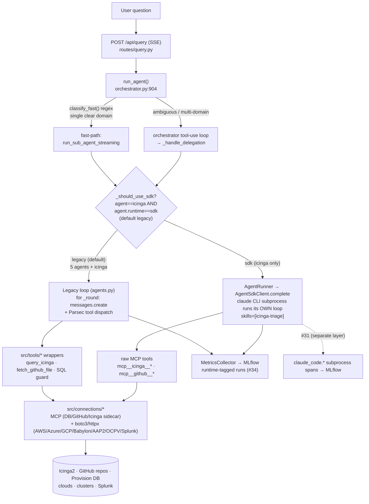
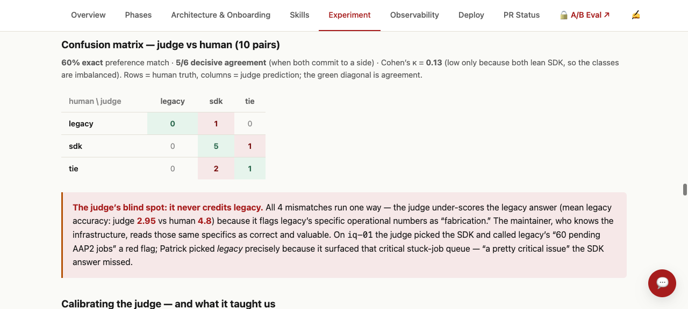
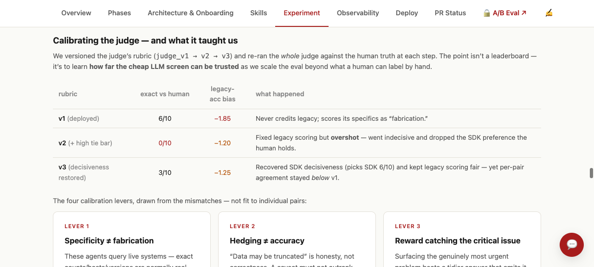

# Parsec → Claude Agent SDK migration — engineering onboarding

*A grounded, code-level walkthrough of how Parsec is being migrated from the raw Anthropic API to the **Claude Agent SDK**, written for an engineer joining the workstream. Every claim cites `file:line` and the PR it came from.*

> **One-sentence model.** Parsec has always hand-written its own Claude tool-use loop (`for _round in range(max_rounds): client.messages.create(...)`). The migration introduces a **second runtime** — the Claude Agent SDK, which runs *its own* agentic loop inside a bundled `claude` CLI subprocess — selected by a single config flag `agent.runtime` (default `legacy`). It is **additive and dormant by default**. Phase 1 built the seam; Phase 2 piloted one sub-agent (Icinga); **Phase 3 ([#40](https://github.com/rhpds/parsec/pull/40)) builds the ability to run the whole turn — orchestrator and all six sub-agents — on the SDK, and ships it switched off.** Nothing merged so far changes what a request does: see §12 for the three switches and their defaults.

---

## 1. PR map — the whole lineage

The migration sits on top of a pre-existing multi-agent architecture. Read these in order; the doc cites them throughout.

**Foundation (pre-migration — the architecture the migration inherits):**
- [#1](https://github.com/rhpds/parsec/pull/1) — Improve agent instructions with playbooks *(MERGED)* — the per-agent prompt content.
- [#6](https://github.com/rhpds/parsec/pull/6) — **Orchestrator + sub-agent architecture** *(MERGED, `f0e4f26`)* — created `agents.py`, the `AGENTS` registry, the regex fast-path, `learnings.py`. The whole multi-agent design.
- [#7](https://github.com/rhpds/parsec/pull/7) — raise `security` `max_rounds` 8→20 *(MERGED)*.
- [#8](https://github.com/rhpds/parsec/pull/8) — **Icinga monitoring agent + MCP sidecar** *(MERGED, `dca36f8`, 2026-03-31, Andrew Jones)* — the icinga sub-agent the migration later pilots. Predates the SDK work.
- [#15](https://github.com/rhpds/parsec/pull/15) / [#18](https://github.com/rhpds/parsec/pull/18) / [#21](https://github.com/rhpds/parsec/pull/21) — MLflow tool-tracing + session-id *(MERGED)* — the observability substrate.

**Skills control plane (this branch — `feat/skills-control-plane`):** health verdicts on
`GET /api/skills`, `POST /api/skills/reload`, per-agent attachment resolved from `parsec.domain`,
install/uninstall of external bundles at a pinned ref, and deletion of the shadowing
`root-cause-analysis` stub. See §14.

**Phase 1 — the SDK seam, dormant (all MERGED):**
- [#23](https://github.com/rhpds/parsec/pull/23) — `SKILL.md` loader + `GET /api/skills` (`74f5f29`).
- [#24](https://github.com/rhpds/parsec/pull/24) — **Claude Agent SDK adapter** behind `agent.runtime` flag (`src/llm/` package).
- [#25](https://github.com/rhpds/parsec/pull/25) — read-only Skills sidebar UI tab.

**Phase 2 — the Icinga pilot (the active work):**
- [#27](https://github.com/rhpds/parsec/pull/27) — ship native skills, baked into the image *(MERGED)*.
- [#30](https://github.com/rhpds/parsec/pull/30) — `AgentRunner` runtime dispatcher *(CLOSED — consolidated into #34)*.
- [#32](https://github.com/rhpds/parsec/pull/32) — Icinga sub-agent on the SDK: skill + profile *(CLOSED — consolidated into #34)*.
- [#34](https://github.com/rhpds/parsec/pull/34) — **the consolidated Phase-2 pilot** *(OPEN)*: runner + `icinga-triage` skill + Node-in-image + MLflow parity/cost harness. Most Phase-2 code below lives here (`migration/sdk-mlflow-metrics`).
- [#31](https://github.com/rhpds/parsec/pull/31) — MLflow tracing for the SDK **subprocess** *(OPEN)* — a *complementary* observability layer (see §3, §7); **not** superseded by #34.
- [#33](https://github.com/rhpds/parsec/pull/33) — document the icinga sub-agent in `CLAUDE.md` *(MERGED)*.

**Phase 3 — the whole runtime:**
- [#40](https://github.com/rhpds/parsec/pull/40) — **orchestrator + all six sub-agents on the SDK** *(MERGED, `b4d1d43`)*. Adds the in-process MCP bridge (`src/agent/parsec_mcp.py`), the SDK orchestrator (`src/agent/sdk_orchestrator.py`), SSE parity (`src/agent/sdk_stream.py`), per-agent profiles (`src/agent/sdk_profiles.py`) and skill publishing (`src/skills/sdk_root.py`). Also carries fixes that apply to **both** runtimes — see §12.
- [#41](https://github.com/rhpds/parsec/pull/41) — **the runtime becomes a deploy variable** *(MERGED)*. Puts `agent.*` in the ConfigMap template and fixes `section()`, which lowercased nothing and so silently dropped every `agent.sdk.*` set by environment variable — Dynaconf uppercases env keys, so `PARSEC_AGENT__SDK__ORCHESTRATOR` had been a no-op.
- [#43](https://github.com/rhpds/parsec/pull/43) — the flip, stacked *(CLOSED — superseded by #44)*.
- [#44](https://github.com/rhpds/parsec/pull/44) — **flips the shipped defaults to the full cutover** *(MERGED, `ccdb746`)*. `playbooks/vars/common.yml` is now `agent_runtime: sdk`, `sdk_enabled_agents: ["all"]`, `sdk_orchestrator: true`. See §12 — the table there describes the *pre-#44* position.
- [#45](https://github.com/rhpds/parsec/pull/45) — **the cutover did not survive contact with a real deployment** *(OPEN)*. Two blockers, both in §13.

**Infra (related, coordinate on merge):**
- [#26](https://github.com/rhpds/parsec/pull/26) — Helm chart for Parsec + MLflow *(OPEN)*.
- [#29](https://github.com/rhpds/parsec/pull/29) — ubi9-minimal Dockerfile hardening + Quay publishing *(OPEN)* — touches the same Dockerfile as #34's Node layer; needs merge-order coordination.

---

## 2. Architecture at a glance


```mermaid
flowchart TD
    U["User question"] --> Q["POST /api/query (SSE)<br/>routes/query.py"]
    Q --> RA["run_agent()<br/>orchestrator.py:904"]
    RA -->|"classify_fast() regex<br/>single clear domain"| FAST["fast-path:<br/>run_sub_agent_streaming"]
    RA -->|"ambiguous / multi-domain"| ORCH["orchestrator tool-use loop<br/>→ _handle_delegation"]
    FAST --> SEAM
    ORCH --> SEAM
    SEAM{"_should_use_sdk?<br/>agent==icinga AND<br/>agent.runtime==sdk<br/>(default legacy)"}
    SEAM -->|"legacy (default)<br/>5 agents + icinga"| LEG["Legacy loop (agents.py)<br/>for _round: messages.create<br/>+ Parsec tool dispatch"]
    SEAM -->|"sdk (icinga only)"| SDK["AgentRunner → AgentSdkClient.complete<br/>claude CLI subprocess runs its OWN loop<br/>skills=[icinga-triage]"]
    LEG --> TOOLS["src/tools/* wrappers<br/>query_icinga · fetch_github_file · SQL guard"]
    SDK --> MCPRAW["raw MCP tools<br/>mcp__icinga__* · mcp__github__*"]
    TOOLS --> CONN["src/connections/*<br/>MCP (DB/GitHub/Icinga sidecar)<br/>+ boto3/httpx (AWS/Azure/GCP/Babylon/AAP2/OCPV/Splunk)"]
    MCPRAW --> CONN
    CONN --> SVC[("Icinga2 · GitHub repos · Provision DB<br/>clouds · clusters · Splunk")]
    LEG --> MET["MetricsCollector → MLflow<br/>runtime-tagged runs (#34)"]
    SDK --> MET
    SDK -.->|"#31 (separate layer)"| TRACE["claude_code.* subprocess spans → MLflow"]
```

The six dimensions below each zoom into one part of this picture.

---

## 3. The SDK change

**What changed:** a second runtime, selected by one flag, returning the same result shape.

- The flag lives in `src/llm/runtime.py`: `get_runtime(config)` reads `agent.runtime`, returns `RUNTIME_LEGACY`/`RUNTIME_SDK` (`runtime.py:12-13`), **defaults to legacy** and **coerces unknown values back to legacy with a warning** (`runtime.py:33-43`) — "so a typo never silently routes traffic to the new untested path." *( #24 )*
- The legacy backend, for contrast, is `_build_client()` (`orchestrator.py:379`): it returns an `anthropic.Anthropic | AnthropicVertex | AnthropicBedrock` and **Parsec drives the loop itself** (`client.messages.create` at `orchestrator.py:1028`, wrapped in `asyncio.to_thread`). Production = Vertex.
- The adapter `src/llm/agent_sdk_client.py` *(#24)* is "a thin async adapter around `claude_agent_sdk.query`." The SDK is imported **lazily** (`importlib.import_module("claude_agent_sdk")`, `agent_sdk_client.py:230`) so the module stays importable without the optional dependency, raising `AgentSdkUnavailableError` only when actually used. Config is resolved once into a frozen `AgentSdkConfig` (`agent_sdk_client.py:28`): `model`, `max_turns` (mapped from `anthropic.max_tool_rounds`), `cwd`, `setting_sources=("project",)`, `timeout=300`.
- `complete()` (`agent_sdk_client.py:114`) is short because **the loop isn't here** — a single `async for` over `sdk.query()` (`:190`) aggregated into an `SdkResult` (tokens, cache, `total_cost_usd`, `num_turns`); failures are captured into the result, never raised, so the SSE stream never aborts.
- The dispatch seam is `AgentRunner` (`src/agent/runner.py`, **#30 → folded into #34**): it resolves the runtime once and routes `_run_via_sdk` vs `_run_via_legacy`, normalizing both to the **identical result dict** (`runner.py:216`) so callers can't tell which ran.

**Default behavior is unchanged.** At `agent.runtime: legacy`, none of this activates.

## 4. Skill invocation

**Mental model: skill = capability (inert data), agent = runner.**

- A skill is a folder with a `SKILL.md` = YAML frontmatter (`name`, `description`, `allowed-tools`, a Parsec `parsec:` block) + a Markdown workflow body. Canonical example: `skills/icinga-triage/SKILL.md` *( #32/#34 )*.
- **Two discovery planes that share a directory but not a code path** (conflating them is the #1 newcomer mistake):
  - **`SkillLoader`** (`src/skills/loader.py`, #23) reads `skills.project_root` / `plugin_paths` / `user_root`. It backs `GET /api/skills` and the Skills tab, and validates in CI. It never executes anything.
  - **The Agent SDK** discovers skills **only** under `<cwd>/.claude/skills/`, because `agent.sdk.setting_sources` is `["project"]`.
- **`sync_sdk_skill_root()`** (`src/skills/sdk_root.py`, called from `src/app.py`) bridges them at startup by symlinking every discovered skill into the SDK's root. So **anything the loader discovers becomes SDK-executable** — there is no "listed but safe" state. The Dockerfile seeds that root as a real directory of per-skill symlinks (not one symlink to `skills/`), so baked and mounted skills coexist as siblings.
- **Activation** is resolved per request, not hardcoded: operator override → the skill's own `parsec.domain` → the `_AGENT_SKILLS` supplement, unioned (`src/skills/attachment.py`). `skills_for(agent_type)` feeds `AgentDefinition.skills`. A well-formed mounted skill therefore attaches with **no code change**.
- **`allowed-tools` in frontmatter is a request, not a grant.** Containment is `AgentSdkConfig.builtin_tools` (`("ToolSearch", "Skill")` — no Bash/Read/Write) plus the per-agent bridged `mcp__parsec__*` set. A skill declaring tools Parsec does not grant will make the model flail silently, which is why health flags it (§14).
- **Name collisions:** `project_root` wins `SkillLoader._deduplicate`. An in-repo copy silently shadows a mounted copy of the same name — this bit us once, see §14.

## 5. Loop / harness

**Legacy** (`agents.py:353`, `run_sub_agent`, from #6): `for _round in range(agent_cfg.max_rounds): messages.create(system, tools, messages)`. The whole `messages` list is **re-sent uncached every round** — this is the cost lever the migration attacks. Tool dispatch is hand-written (`_execute_tool` + 10s slow-tool polling), with a budget-warning nudge 2 rounds before the cap and a confidence score at the end.

**SDK** (`agent_sdk_client.py:114` + `runner.py:145`): one `async for` over `sdk.query()`; the subprocess runs the loop and **prompt-caches the system+skill prefix server-side**. `max_turns` is the SDK analogue of `max_rounds`; `timeout` (300s) is a wall-clock ceiling the in-process legacy loop doesn't need.

**The dispatch seam** is one predicate, `_should_use_sdk(agent_type, cfg)` (`agents.py:289` on #34): `return agent_type == "icinga" and get_runtime(cfg) == RUNTIME_SDK`. Checked at both `run_sub_agent` and `run_sub_agent_streaming` so they never drift. The SDK streaming path currently arrives as a **single SSE chunk** (not token-by-token) — a documented Phase-2 limitation (`agents.py:725-731`).

**The harnesses** *(#34)* answer the two Phase-2 questions:
- `scripts/parity_eval.py` — **accuracy**: runs the same Icinga queries through *both* runtimes, an **independent LLM judge** (anonymized A/B, deterministic per-id flip) scores each, and it computes four gates: `success_all`, `quality_parity ≥ 0.90`, `latency ≤ 1.5×`, `cost ≤ 1.3×` (`parity_eval.py:54-57, 270-290`). `--selftest` exercises the math with no cluster.
- `scripts/ab_mlflow.py` + `parsec-dependencies/pr2-test/test_icinga_ab.py` — **cost**: a controlled legacy-vs-SDK A/B that breaks out cache tokens.

**Cost result (reproduced 2026-06-09):** SDK **warm $0.037** vs a legacy bare call $0.0106 → warm/legacy **3.45×** — a fixed 28,665-token *cached* prefix, not the "≈270×" headline (that was a cold cache-write vs a hello-world call). Against *real* legacy Icinga work (≈$1.38/query, ~452K uncached tokens × 10 rounds) the SDK's caching projects **cheaper, not costlier**.

> **Frontier update (2026-06-29):** the accuracy/parity gate has now **run** — a blinded human-labeling A/B on the Icinga agent puts the SDK **on par or better** (preliminary). See §9. Remaining caveats: the cost A/B's "legacy" arm is still a single bare call (not the production multi-round path), and the in-cluster `parity_eval.py` run still wants `parsec-dev` access (`parsec-dependencies/pr2-test/PARITY-RUNBOOK.md`).

## 6. Injected system prompts

Both runtimes assemble the system prompt the **same way**, via `get_agent_prompt(agent_type)` (`src/agent/system_prompt.py:91`):
- **Orchestrator** = `orchestrator.md` standalone.
- **Every sub-agent** = `shared_context.md` (12 KB, the cross-cutting rules) + its domain `*_agent.md`, then the **reporting-DB MCP reference** is appended (`system_prompt.py:124`), then **learnings** (`system_prompt.py:132`). Cached on input mtimes, so it hot-reloads.
- **Legacy injection:** `system = f"{get_agent_prompt(agent_type)}\n\nToday's date is {today}."` → `messages.create(system=…)` (`agents.py:423-426, 464`).
- **SDK injection:** `_run_via_sdk` loads the **same** `get_agent_prompt(agent_type)` (`runner.py:175`) "so the two paths share prompt content for a fair benchmark," passed as `ClaudeAgentOptions.system_prompt`. Two differences: (a) **no "Today's date" suffix** on the SDK path (a small asymmetry), and (b) it **additionally loads the SKILL.md**.
- **The Icinga overlap to know about:** on the SDK path the triage workflow is injected *twice* — once in the system prompt (`icinga_agent.md`, talking about `query_icinga`) and once in the skill (`SKILL.md`, talking about `mcp__icinga__*`). The skill is meant to be the authoritative procedural layer for the SDK; the prompt is still injected for benchmark parity. Known redundancy to reconcile before they drift.
- **The learnings layer** (`src/agent/learnings.py`, from #6) is *orthogonal to routing*: after a conversation Claude extracts 1–3 learnings into `data/agent_learnings.md` (capped at 50), which `get_agent_prompt` appends to every prompt — data-driven *tuning*, not routing or agent definition.

## 7. Connectors with other services

Parsec reaches ~10 systems in **two transport families**:
- **MCP servers** — reporting/provision DB + GitHub (JSON-RPC over **streamable-HTTP**, shared helper `connections/mcp_common.py`) and the Icinga **sidecar** (**SSE**, `connections/icinga_mcp.py`, from #8).
- **Direct SDK / REST** — AWS (boto3), Azure (blob), GCP (BigQuery), and hand-rolled `httpx` K8s/REST clients for Babylon / OCPV / AAP2 / Splunk.

Every connector `init_*()` degrades gracefully when unconfigured, and the dependent tool is **gated** (hidden from the model) — e.g. `_is_icinga_configured()` (`tool_definitions.py:1358`). Per-agent tool groups are assembled by `get_<agent>_tools()`.

**The legacy vs SDK distinction is the heart of this dimension:**
- **Legacy:** model → Parsec tool schema (`query_icinga`) → the orchestrator runs a `src/tools/` **wrapper** (which does real work: Icinga **action-alias remapping**, GitHub **`_redact_secrets`**, **SQL validation**) → the connection → the service.
- **SDK (icinga pilot):** `build_icinga_sdk_profile` hands the **same** Icinga-sidecar + GitHub MCP URLs **straight to `ClaudeAgentOptions(mcp_servers=…)`** (`icinga_sdk.py:52,56-60`). The model calls **raw** `mcp__icinga__*` / `mcp__github__get_file_contents`, and the SDK subprocess connects directly — **the `src/tools/` wrappers are bypassed.**

**What the SDK path therefore SKIPS, and how the skill compensates:**

| Wrapper behavior (legacy) | SDK path | Compensation |
|---|---|---|
| Icinga **action-alias map** (remaps hallucinated names) | gone | SKILL.md lists the exact `mcp__icinga__*` names + "do not invent names like `search_alerts`…" |
| GitHub **`_redact_secrets`** (masks AgnosticV secrets) | gone | **Not fully replaced** — the one real gap; a Phase-2 follow-up (SDK output hook, or keep GitHub behind the wrapper) |
| Icinga **write-arg validation** | partial (MCP server still validates) | SKILL.md "Write Operations (gated)" — only on explicit request |

## 8. Pre-existing sub-agents

Long before the SDK work, Parsec was already a multi-agent system *(#6, `f0e4f26`)*. `src/agent/agents.py` holds the `AGENTS` registry — **six explicit, file-defined sub-agents**, each an `AgentConfig` (name, `prompt_file`, `tools_fn`, `max_rounds`):

| agent | max_rounds | what it does | origin |
|---|---|---|---|
| `cost` | 8 | cloud spend, GPU abuse, ODCR waste | #6 |
| `aap2` | 20 | "why did this provision/lab fail?" — config-trace | #6 |
| `babylon` | 8 | catalog items, deployments, workshops | #6 |
| `security` | 20 | CloudTrail, account inspection, abuse | #6 (+#7 raised rounds) |
| `ocpv` | 8 | CNV cluster / PVC / VM diagnosis | `dea2f97` |
| `icinga` | 15 | triage Icinga2 alerts vs GitHub check-script source | **#8 / `dca36f8`** |

These are **not** created by the migration, **not** derived from usage, **not** discovered at runtime — they're hand-written `AgentConfig` entries. Routing: `classify_fast()` (pure regex, mutual-exclusion guards) short-circuits obvious single-domain questions; otherwise the orchestrator's LLM loop delegates via `_DELEGATION_TOOL_MAP` → `_handle_delegation` (`orchestrator.py:681,691`). Both routes converge on `run_sub_agent`/`run_sub_agent_streaming`.

**What the migration changes here: essentially nothing.** `orchestrator.py`'s routing, `_DELEGATION_TOOL_MAP`, `classify_fast`, and the registry are **identical** between `upstream/main` and #34. The fork is one level down, gated by `_should_use_sdk` → the precise tuple `(icinga, runtime=sdk)`. Five of six agents are physically incapable of hitting the SDK; icinga under the default flag runs the same legacy loop it has since `dca36f8`. This is the deliberate **"one sub-agent on the SDK, behind a flag"** pilot — a minimal, reversible wedge.

---

## 9. The parity result — does the SDK pass the gate?

**Yes, preliminarily.** The Phase-2 gate is one question: is the SDK at least as good as legacy before flipping `agent.runtime`? We answer it two ways on the migrated Icinga agent, on the same 10 fresh Icinga pairs — a blinded **human-labeling** gate (the verdict of record) and a cheaper **LLM-as-judge** screen.

- **Human gate** — the maintainer (Patrick) labeled all 10: verdict **`preliminary on-par`** — accuracy tied (legacy 4.8 = SDK 4.8 / 5), actionability +0.5 SDK, preference **SDK 6 · tie 3 · legacy 1**. (Not yet "powered" — a firm verdict wants ≥ 15 decisive labels / a 2nd rater.)
- **LLM-judge** (Opus 4.6) agrees on direction (SDK ≥ legacy on every pair) but **systematically under-scores legacy** — it flags legacy's specific operational numbers as "fabrication" (mean legacy accuracy 2.95 vs the human's 4.8). 60% exact agreement, 5/6 decisive.



**Calibrating the judge against the human.** We versioned the judge rubric (`judge_v1 → v2 → v3`) and re-ran the whole judge against the human truth at each step. Tuning **fixes the per-axis scores** (legacy-accuracy bias −1.85 → −1.25) but **no rubric matches the human's per-pair preference better than the original** — because v1's blanket pro-SDK bias *accidentally* aligned with the human's own SDK lean (fix the reason, lose the lucky alignment). At n = 10 / one rater you can calibrate the judge's scores, not reliably its preference — so the LLM-judge stays a directional **screen**, the human gate the **verdict of record**.



> **Method + data:** [redhat-et/rhdp-parsec-integration#3](https://github.com/redhat-et/rhdp-parsec-integration/pull/3) — `benchmark/` (vote dump, confusion-matrix analysis, the three judge rubrics, scrubbed results). **Live, interactive:** the [plan-site parity section](https://parsec-plan-production.up.railway.app/#parity-results). The labeling pages (`/ab-eval`, `/ab-label`) are login-gated and sanitized.

### Frontier — what's done vs. not

| Built & verified | Built, NOT yet run | Open / coordinate |
|---|---|---|
| SDK adapter + flag (#24); runner + icinga skill/profile + MLflow run-metrics (#34); live in-cluster on NERC; cost A/B ("270× debunked"); **accuracy/parity gate run via human labeling → SDK on-par-or-better (preliminary)** | **Powered** human verdict (≥ 15 decisive labels / 2nd rater); in-cluster `parity_eval.py` (needs `parsec-dev` access); production multi-round cost A/B | #31 subprocess tracing (additive follow-up); #29 Dockerfile order; GitHub secret-redaction parity on the SDK path |

## 10. File map (where to look first)

- **Flag/adapter:** `src/llm/runtime.py`, `src/llm/agent_sdk_client.py`, `src/llm/__init__.py` *(#24)*
- **Dispatch:** `src/agent/runner.py` (`AgentRunner`), `src/agent/agents.py` (`_should_use_sdk` :289, the two dispatch sites) *(#30→#34)*
- **Skill:** `src/skills/loader.py`, `src/routes/skills.py` *(#23)*; `skills/icinga-triage/SKILL.md`, `src/agent/icinga_sdk.py` *(#34)*
- **Prompts:** `src/agent/system_prompt.py`, `config/prompts/*.md`, `src/agent/learnings.py`
- **Connectors:** `src/connections/*`, `src/tools/{icinga,github_files,provision_db}.py`, `src/agent/tool_definitions.py`
- **Harnesses:** `scripts/parity_eval.py`, `scripts/ab_mlflow.py`, `scripts/icinga_eval_set.json`, `parsec-dependencies/pr2-test/PARITY-RUNBOOK.md`
- **Pre-existing agents:** `src/agent/agents.py` (`AGENTS` :75), `src/agent/orchestrator.py` *(#6, #8)*

---

## 12. Phase 3 — the whole turn on the SDK (#40)

Phases 1–2 ran *one sub-agent* through the SDK. Phase 3 adds the ability for the
SDK to be the orchestrator too, so a request *can* be served end to end without
the legacy loop — but the shipped defaults do not do that.

**Three switches** — shipped in the legacy position by #40, made deploy variables by #41,
and flipped to the SDK position by [#44](https://github.com/rhpds/parsec/pull/44):

| key | #40 default | shipped default today |
|---|---|---|
| `agent.runtime` | `legacy` | `sdk` |
| `agent.sdk.enabled_agents` | `["icinga"]` | `["all"]` |
| `agent.sdk.orchestrator` | `false` | `true` |

`agent.sdk.allow_writes` stays `false`. The rest of this section describes the #40
position, which is still the useful mental model for how the switches interact.

`_should_orchestrate_via_sdk` (`src/agent/orchestrator.py`) requires `runtime: sdk`
**and** `orchestrator: true`, and fails safe to legacy on any exception. With the
defaults, `run_agent` never reaches `run_agent_via_sdk`. The only place all three
are set is `playbooks/parsec-sdk-e2e.yaml`, which deploys a *separate* evaluation
instance — not `parsec-dev` and not `parsec`.

They are separate on purpose: migrate one sub-agent, then several, then the
orchestrator, rolling back each step independently. Flipping them in a real
environment is a follow-up decision, not part of this PR.

**The pieces**

| file | what it does |
|---|---|
| `src/agent/parsec_mcp.py` | In-process MCP server exposing the existing `src/tools/*` to the SDK. Tool code is untouched; writes stay gated by `WRITE_ACTIONS`. |
| `src/agent/sdk_orchestrator.py` | One `ClaudeSDKClient` session *is* the orchestrator. The six sub-agents become native `AgentDefinition`s, each with its own prompt, tool group, turn budget and skills. |
| `src/agent/sdk_stream.py` | Translates SDK messages into the SSE vocabulary the UI already speaks (`text`, `tool_start`, `agent_start`, `skill_used`, `history`, `done`), so the frontend needed no rewrite. |
| `src/agent/sdk_profiles.py` | Per-agent tool/skill/turn resolution. `_AGENT_SKILLS` maps each agent to **all** the skills it should carry. |
| `src/skills/sdk_root.py` | Publishes loader-discovered skills into `<cwd>/.claude/skills` so the SDK can find them. |

**Two failures that were silent**

Both cost real debugging time and are worth knowing about:

- **Sub-agents were denied every tool call.** `permission_mode="dontAsk"` with only the
  *orchestrator's* tools in `allowed_tools` meant a delegated agent could call nothing —
  and it did not error. Icinga returned a fluent *"unable to access the monitoring system
  due to permission restrictions"* with **zero** tool calls. Fixed by approving the union
  of every agent's tools (`allowed_tools` is session-wide approval; `AgentDefinition.tools`
  is per-agent availability — they are not the same thing).
- **Delegation never fired.** `config/prompts/orchestrator.md` still named 13
  `investigate_*` tools that do not exist under the SDK. `_delegation_addendum()` translates
  those instructions onto the `Agent` tool.

**Routing — the finding that needs no judge**

Only the legacy arm has the regex fast path: `run_agent_via_sdk` is dispatched at
`orchestrator.py:1218`, *before* `classify_fast` is reached at `:1249`. So legacy's routing
is pinned wherever the regexes resolve and the SDK's never is. In the n=20 A/B, **all 9
ambiguous rounds incorrectly routed on legacy, in every repeat** — an Icinga alert whose name
contains "Babylon" matches `\bbabylon\b`, so `classify_fast` hands it to the babylon
agent, which has no Icinga tools. Deterministic and reproducible.

**Prompt caching**

The SDK marks its prompt prefix cacheable; the legacy runtime sets **no** `cache_control`
breakpoints anywhere, so its cache counters are zero by construction. Over 50 calls:
legacy 13,699,398 fresh input tokens and 0 cached; SDK 225 fresh and 6,173,328 cached
(**93.6%** hit), for **46% less spend**. Note this cuts against latency — the SDK is
~1.9× the tool calls and ~20% slower at the median.

**Costs, stated plainly**

1.9× tool calls, 1.4× tool errors, slower. The retry churn is a defect, not a tradeoff.

**Evidence:** harness, raw runs, judge output and screenshots live in
[`redhat-et/rhdp-parsec-integration/eval/`](https://github.com/redhat-et/rhdp-parsec-integration/tree/main/eval);
gated pages at `/deck` (n=20, ten tabs), `/parity` (the original 10-query Icinga A/B),
`/parity/v1` and `/parity/v2`.

---

## 13. What the cutover hit in a real deployment (#45)

Flipping the defaults (#44) was not the end of it. `parsec-dev` was switched to
`runtime: sdk` and every question came back:

```
the agent runtime failed: Not logged in · Please run /login
```

Two separate bugs, neither a logic error, both in the same blind spot: **something the
app process has that never reaches the CLI subprocess the SDK forks.** That subprocess is
a different process with different configuration, and every test mocks the SDK, so nothing
caught either one. Worth internalising as a category before adding anything else here.

**1 — The subprocess had no credentials.** The CLI authenticates itself from
`ANTHROPIC_*` / `CLAUDE_CODE_*`. It cannot see Parsec's `anthropic.*` settings: they arrive
as `PARSEC_ANTHROPIC__*`, and `build_subprocess_env` denies that namespace deliberately,
since it holds every app secret (§7). Nothing translated one into the other. It looked fine
because the runtime was only ever proven on `playbooks/parsec-sdk-e2e.yaml`, which sets
`CLAUDE_CODE_USE_VERTEX` and `GOOGLE_APPLICATION_CREDENTIALS` **by hand on the pod**;
`parsec-dev` and `parsec` run the LiteLLM backend and set neither.
`backend_cli_env()` now derives the CLI's auth from `anthropic.backend` for all four
backends, and evicts the other backends' keys so a stale `CLAUDE_CODE_USE_VERTEX` cannot
send the CLI to Vertex while the app talks to the gateway.

**2 — The Dockerfile's CLI pin was decorative.** `npm install -g
@anthropic-ai/claude-code@2.1.169` decides nothing on its own: the SDK's `_find_cli()`
prefers a CLI bundled inside the `claude-agent-sdk` wheel, which floats with the Python
package. The bundled 2.1.185 sends `anthropic-beta: thinking-token-count-2026-05-13`, and
the gateway's Vertex upstream rejects it with a 400 — while the pinned 2.1.169 answered the
same prompt. `cli_path` now defaults to the pinned binary, **and the orchestrator path
passes it at all**, which it never did: only `AgentSdkClient._build_options` set it, so the
whole-turn cutover ignored even an explicit `agent.sdk.cli_path`.

**How it was verified, and why that mattered.** `parsec-dev`'s configuration was reproduced
on a separate instance and the real production query run at each step — the first fix alone
was not enough, and only running it end to end showed that:

| build | outcome |
|---|---|
| before | fails **silently** — no error event, empty answer, 0 tokens, 2s |
| + credentials fix | authenticates, then 400s on the beta header |
| + CLI pin | completes: `icinga` agent, `icinga-triage` skill, 20 tool calls, 2718-char answer |

**Error surfacing.** The runtime's wording reached the chat box verbatim, and an
investigator read "Please run /login" as an instruction and typed it into Parsec.
`_failure_reason` now names deployment faults as deployment faults, keeping the raw text
alongside for the log.

**Still open.** A parallel audit confirmed 12 further SDK-path defects — dead
`agent.sdk.timeout` on the orchestrator, `total_latency_ms` / `tool_calls` / `tool_errors`
always 0, history written as a bare string (so the learnings loop is dormant and reloaded
conversations lose their tool calls), `icinga-triage/SKILL.md` naming tools the MCP bridge
replaced, container CPU never raised for the Node subprocess, and Icinga **writes**
reachable from the SDK orchestrator that the legacy orchestrator could not reach. None of
them block the cutover; all of them are real.

---

## 14. Skills control plane — health, hot reload, attachment, install

Adding a skill used to mean a config change, a PR, an image rebuild and a redeploy. Almost none of
that was architectural. `discoverable_skill_names()` reads the filesystem on every call,
`build_orchestrator_options()` runs per request, and the `claude` CLI is spawned fresh per query —
**the only startup-bound step in the whole path is publishing the symlinks**.

**The five stages, and when each runs**

| | Stage | Runs |
|---|---|---|
| 1 | Source roots on disk (`project_root`, `plugin_paths`) | whenever bytes land |
| 2 | `SkillLoader` discovery + dedup (`project_root` wins) | every call |
| 3 | `sync_sdk_skill_root()` → `<cwd>/.claude/skills/` | **startup, or `POST /api/skills/reload`** |
| 4 | Attachment: override → `parsec.domain` → supplement | every request |
| 5 | SDK subprocess reads the root and activates | every request |

**Health** (`src/skills/health.py`). The loader answers "did this parse", which is much weaker than
"will this work". `GET /api/skills` now returns a verdict per skill:

- `unusable` — requests withheld built-ins (Bash/Read/Write), **or** references files it did not
  ship, **or** its procedure assumes a shell.
- `orphaned` — attached to no agent, so nothing can activate it.
- `ok` — plus `notes` for non-blocking observations.

Calibration is deliberate: three shipped skills declare `mcp__reporting__*`, which never resolves
(the Reporting tools are bridged as `mcp__parsec__db_*`). That is stale frontmatter, so it is a
**note**, not a status. A check that fires on most of the fleet is one nobody reads.

**Why this existed.** `skills/root-cause-analysis` was vendored from `redhat-et/rhdp-rca-plugin` as
a `SKILL.md` with no payload. It drove `.venv/bin/python scripts/cli.py` against a `scripts/`
directory that was never copied, and requested `Bash/Read/Write`, which this runtime does not grant.
It parsed cleanly, reported `sdk_visible: true`, carried no warnings, and was inert. Worse, because
`project_root` wins `_deduplicate`, it **shadowed the real 32-file bundle** whenever that was
mounted — verified on the cluster: a freshly installed copy at `ea43c5c1` lost to it. The stub is
deleted; `aap2-job-failure-rca` carries the same method against bridged tools.

**Endpoints** (all admin-gated via the same `X-Forwarded-Email` path as `/api/learnings`):

- `POST /api/skills/reload` — re-runs discovery and republishes the SDK root. No pod restart.
- `PUT|DELETE /api/skills/{name}/attachment` — move a skill between agents, or switch it off.
- `POST /api/skills/install` — clone a bundle at a pinned ref. **Off by default**
  (`skills.install_enabled`), host-allowlisted, size-capped, symlinks stripped on copy, accepts a
  `skills: [...]` filter, and records the resolved SHA inside each installed skill.
- `DELETE /api/skills/{name}` — remove an installed skill. Refuses anything outside
  `skills.install_root`, so in-repo skills can only be removed by a PR.

**Config** (`config/config.yaml`, all settable as `PARSEC_SKILLS__*` deploy vars):
`state_path`, `install_root`, `install_enabled`, `install_hosts`.

**Gotcha worth knowing.** Dynaconf materialises env-supplied settings with **UPPERCASE** keys when
`config.yaml` does not already declare them, so a deployed pod's skills section is genuinely
mixed-case. Every skills config read goes through `src/llm/config_section.section`, which lowercases
— the same helper the `agent.sdk.*` bug needed. Reading lowercase directly silently drops every
deploy-var override.

**Limits.** Adding a new `plugin_paths` *root* is still a pod-template change (restart). Hot install
removes PR review as the gate, which is why it is off by default and provenance-recording; the
production recommendation remains a digest-pinned bundle, not a free-text URL.
